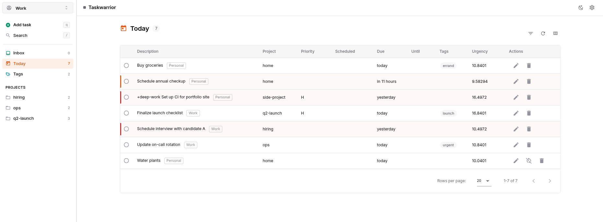
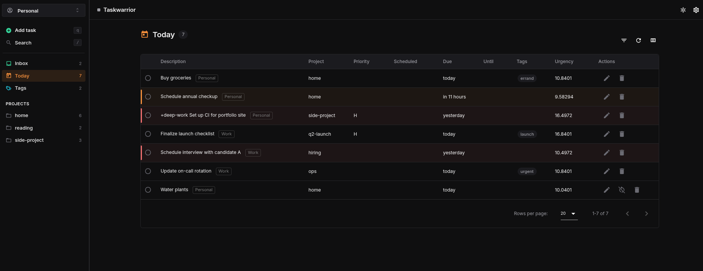

# Taskwarrior-webui (personal fork)

Personal fork of [DCsunset/taskwarrior-webui](https://github.com/DCsunset/taskwarrior-webui). Upstream has been effectively inactive since late 2024, so this fork is where new features and fixes live. The original stack — Vue.js (Nuxt 2 + Vuetify) frontend, Koa.js backend wrapping the `task` CLI — is preserved.

## About this fork

This fork is maintained primarily for personal use. Compared to upstream it adds:

- A redesigned UI (minimal, Linear/Todoist-inspired) replacing the Material Design defaults.
- A "Today" tab combining due-today and overdue tasks, with collapsible recurring instances.
- An Inbox view (pending tasks with no project and no parent — strict GTD).
- Multi-profile support: switch between several `.taskrc` / `.task` pairs from the UI.
- Per-user authentication via Cloudflare Access, with per-profile authorization.
- Client-side text search with `/` and `Ctrl+K` shortcuts.
- Mobile-friendly tweaks: denser rows and a quick-add FAB.
- Reusable date/time picker for `Due` / `Until` / `Scheduled` / `Wait` fields.
- Backend write serialization per profile to prevent data corruption under concurrent edits.

See [`CHANGELOG.md`](./CHANGELOG.md) for the detailed feature inventory with commit SHAs.

## Screenshots





## Features

- Responsive layouts and PWA support
- Light and dark themes
- Sync with a Taskserver / Taskchampion server
- Multi-profile sync targets
- Optional Cloudflare Access authentication
- Easy to deploy (single Docker image)

## Deployment

This fork is deployed by building the image locally and streaming it to a VPS over SSH (`docker save | ssh ... docker load`), then `docker compose up -d`. There is no public registry in the loop — the upstream's CI workflow publishes to its own Docker Hub namespace and is not used here.

A helper script `deploy.sh` automates build + transfer + restart. See [`DEPLOY.md`](./DEPLOY.md) for the full setup, including Cloudflare Access configuration, the per-user `users.json` mapping, rollback and image hygiene.

If you just want to run it locally without the SSH/VPS flow, the simplest path is:

```sh
docker build -t taskwarrior-webui .
docker run -d -p 8080:80 --name taskwarrior-webui \
    -v $HOME/.taskrc:/.taskrc -v $HOME/.task:/.task \
    taskwarrior-webui
```

Then open `http://127.0.0.1:8080`.

> Taskwarrior v2 and v3 data files are **not** cross-compatible. The Dockerfile pulls `task3` from Alpine `edge/community`, so the resulting image is v3-only.

If your `.taskrc` references absolute paths (e.g. `/home/you/ca.cert.pem` for taskserver certs), mount the files at the same paths inside the container and set `TASKRC` / `TASKDATA` accordingly:

```sh
docker run -d -p 8080:80 --name taskwarrior-webui \
    -e TASKRC=$HOME/.taskrc -e TASKDATA=$HOME/.task \
    -v $HOME/.taskrc:$HOME/.taskrc -v $HOME/.task:$HOME/.task \
    taskwarrior-webui
```

## Configuration

Environment variables read by the backend:

| Variable | Default | Purpose |
|---|---|---|
| `TASKRC` | `/.taskrc` | Path to the `.taskrc` file |
| `TASKDATA` | `/.task` | Path to the `.task` data directory |
| `PROFILES_CONFIG` | `/profiles.json` | Optional JSON file declaring multiple profiles |
| `USERS_CONFIG` | `/users.json` | Maps authenticated emails to allowed profiles (Cloudflare Access mode) |
| `AUTH_MODE` | `cloudflare` | `cloudflare` (verify JWT) or `dev` (bypass; local only) |
| `CF_ACCESS_TEAM_DOMAIN` | — | Required when `AUTH_MODE=cloudflare` |
| `CF_ACCESS_AUD` | — | Required when `AUTH_MODE=cloudflare` |
| `DEV_USER_EMAIL` | `dev@localhost` | Email injected as the request user in `dev` mode |
| `CALDAV_ENABLED` | `false` | Set to `true`/`1` to mirror timed tasks into a CalDAV calendar |
| `CALDAV_BASE_URL` | — | Calendar collection URL, e.g. `https://radicale.example/user/tasks/` |
| `CALDAV_USERNAME` | — | Optional basic-auth username for CalDAV |
| `CALDAV_PASSWORD` | — | Optional basic-auth password for CalDAV |
| `CALDAV_ALARM_TRIGGER` | `-PT10M` | iCalendar alarm trigger for mirrored events |
| `CALDAV_EVENT_DURATION_MINUTES` | `15` | Duration assigned to generated calendar events |
| `CALDAV_TIMEZONE` | `TZ` or `Europe/Madrid` | Time zone used to distinguish timed values from date-only midnight deadlines |
| `CALDAV_REQUEST_TIMEOUT_MS` | `5000` | Timeout for each CalDAV `PUT`/`DELETE` request |

When `TASKRC` or `TASKDATA` is changed, mount the files at the matching paths inside the container.

### Multiple profiles

Mount a JSON file declaring one entry per profile:

```json
{
  "profiles": [
    { "name": "personal", "taskrc": "/profiles/personal/.taskrc", "taskdata": "/profiles/personal/.task" },
    { "name": "work",     "taskrc": "/profiles/work/.taskrc",     "taskdata": "/profiles/work/.task" }
  ]
}
```

```sh
docker run -d -p 8080:80 --name taskwarrior-webui \
    -v $PWD/profiles.json:/profiles.json \
    -v $HOME/.taskrc:/profiles/personal/.taskrc \
    -v $HOME/.task:/profiles/personal/.task \
    -v $PWD/work/.taskrc:/profiles/work/.taskrc \
    -v $PWD/work/.task:/profiles/work/.task \
    taskwarrior-webui
```

A profile selector appears in the top bar whenever two or more profiles are defined. If `PROFILES_CONFIG` points to a missing file, the UI falls back to a single default profile using `TASKRC` and `TASKDATA`.

### CalDAV task alerts

The backend can mirror timed Taskwarrior tasks into a CalDAV calendar, such as Radicale, as `VEVENT` entries with a `VALARM`. Taskwarrior remains the source of truth; calendar entries are only a projection for calendar views and client-side reminders.

Mirroring is enabled only when `CALDAV_ENABLED` is truthy and `CALDAV_BASE_URL` points at a calendar collection. A pending task is mirrored when it has `scheduled` with a non-midnight time; if not, `due` with a non-midnight time is used. Date-only values are ignored so ordinary deadlines do not become noisy reminders. Completed, deleted, waiting without a timed reminder, or untimed tasks remove their generated event.

Generated event UIDs are stable: `taskwarrior-{profile}-{uuid}`. The same UID is also used as the `.ics` resource filename under `CALDAV_BASE_URL`, so updates are idempotent across repeated writes and task syncs.

To repair the calendar projection manually:

```sh
curl -X POST http://localhost:3000/calendar/reconcile
curl -X POST http://localhost:3000/calendar/reconcile/all
```

### Authentication

Two modes:

- **`AUTH_MODE=cloudflare`** (default in production): every request must carry a valid `Cf-Access-Jwt-Assertion` header. Configure a Cloudflare Access self-hosted application in front of the deployment, then provide `CF_ACCESS_TEAM_DOMAIN` and `CF_ACCESS_AUD`. Authenticated emails are mapped to allowed profiles via `users.json`. Full walkthrough in [`DEPLOY.md`](./DEPLOY.md).
- **`AUTH_MODE=dev`**: skips JWT verification and treats every request as authenticated as `DEV_USER_EMAIL`. Used by the dev npm scripts (`npm run dev`). Do not use in production.

If you don't want Cloudflare Access, you can keep `AUTH_MODE=cloudflare` disabled by replacing the auth layer with another reverse proxy (basic-auth via nginx, mTLS, etc.) — but `users.json`-based per-user profile authorization assumes the email claim from Cloudflare Access. Without it, all requests run under the dev user.

### Manual build (no Docker)

Frontend:

```sh
cd frontend
npm install
npm run build
npm run export   # generates frontend/dist (static)
```

Backend:

```sh
cd backend
npm install
npm run build
npm start
```

Then serve the frontend with nginx (or another web server) and reverse-proxy `/api/` to the backend (`backend/src/app.ts` listens on port 3000). Reference config: `nginx/server.conf`.

## Development

Two shells:

```sh
# Backend — listens on localhost:3000, uses backend/test/.taskrc and backend/test/.task
cd backend && npm install && npm run dev

# Frontend — Nuxt dev server on localhost:8080, proxies /api → localhost:3000
cd frontend && npm install && npm run dev
```

Open `http://localhost:8080`. The dev `TASKRC` / `TASKDATA` point into `backend/test/`, so local development does not touch your real Taskwarrior data. The backend `npm run dev` script sets `AUTH_MODE=dev`, so requests don't need a JWT during local development.

Node version is pinned at **16.17.1** (`.tool-versions`). The frontend requires `NODE_OPTIONS=--openssl-legacy-provider` (already baked into its npm scripts) because of Nuxt 2 / Webpack 4 crypto compatibility on newer Node releases.

Frontend lint:

```sh
cd frontend && npm run lint   # eslint --fix on .ts/.js/.vue
```

## Sync with a Taskserver

This Web UI supports auto-sync by calling `task sync` periodically. To use it, configure both the taskserver and client manually until `task sync` runs successfully on the host, then map the resulting `.taskrc` and `.task` into the container.

## License

GPL-3.0
